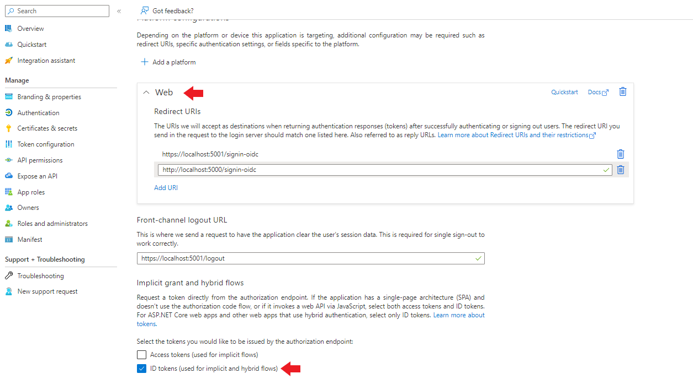
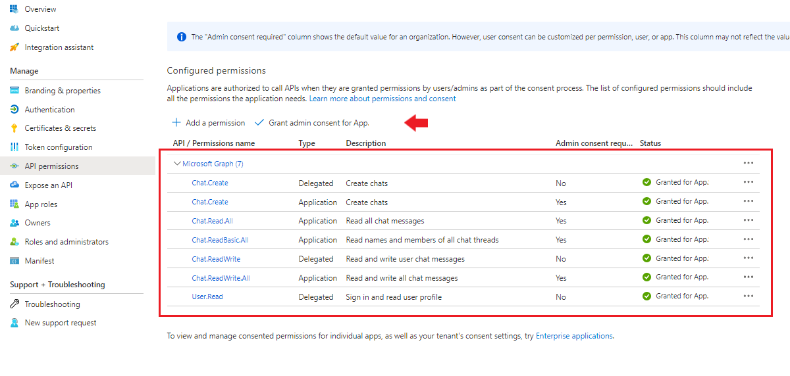

# OpenID with AAD & Teams PoC

A PoC for Azure Active Directory with OpenID authentication

The validity of the issued security token is proven by sending messages to Microsoft Teams chat. It's impossible to send messages in the Graph API application context. Thus, be sure the user, which sends the messages, has the The _'Office 365'_ license. Otherwise, it throws an exception 'Failed to get license information for the user. Ensure the user has a valid Office365 license assigned to them'.

If the solution started for the first time, the database must be created
```
dotnet ef database update
```

Before the start of the application, setup the Authentication authority (AAD) and secrets to access it.  
```
dotnet user-secrets set "ApplicationSettings:JwtKey" "***"
dotnet user-secrets set "ApplicationSettings:AAD:TenantId" "***"
dotnet user-secrets set "ApplicationSettings:AAD:ClientId" "***"
dotnet user-secrets set "ApplicationSettings:AAD:ClientSecret" "***"
```

In order to have access to AAD from the application, it's required to register the application in the domain at https://portal.azure.com/ in the _'App registrations'_ section.
 

_Notes:_

The initial files were generated with ```dotnet aspnet-codegenerator identity```. Thus, it's possible to call pages to login and create users in a local database with the generated UI.

Use __Swagger__ at https://localhost:5001/swagger/index.html to see all API endpoints.

https://jwt.io/ allows checking JWT content.

Azure Active Directory authentication is implemented through OpenID Connect interface with the __'AddOpenIdConnect()'__ helper middleware. Another option with __'AddAzureAD()'__ uses Microsoft AzureAD UI nuget package which is very popular when users search the web about how to integrate AzureAD to their web application. Now marked Obsolete (see https://github.com/aspnet/Announcements/issues/439).

Run a browser and type in the link 'https://localhost:5001/api/challenge'. The browser will show the form to enter credentials for Azure Active Directory OpenID Connect interface.
Then it automatically redirects to the backend.

In order to login with the local database (username and password) call 'https://localhost:5001/api/login':
```json
{
  "userName": "***",
  "password": "***"
}
```

After the user has logged in, check the data endpoint 'https://localhost:5001/api/data'. Do not forget to set the __'Authorization Bearer <token base64>'__ request header.

## Teams:

Make sure all required permissions have been added to the application registration (in the _'API Permissions'_ section under the registered application). Don't forget to grant Admin consent to permissions. 


The listing of messages in a chat in the application context needs an additional Microsoft approval. Otherwise, it throws an exception _'Invoked API requires Protected API access in application-only context when not using Resource Specific Consent. Visit https://docs.microsoft.com/en-us/graph/teams-protected-apis for more details'_.
See details https://learn.microsoft.com/en-us/graph/teams-protected-apis